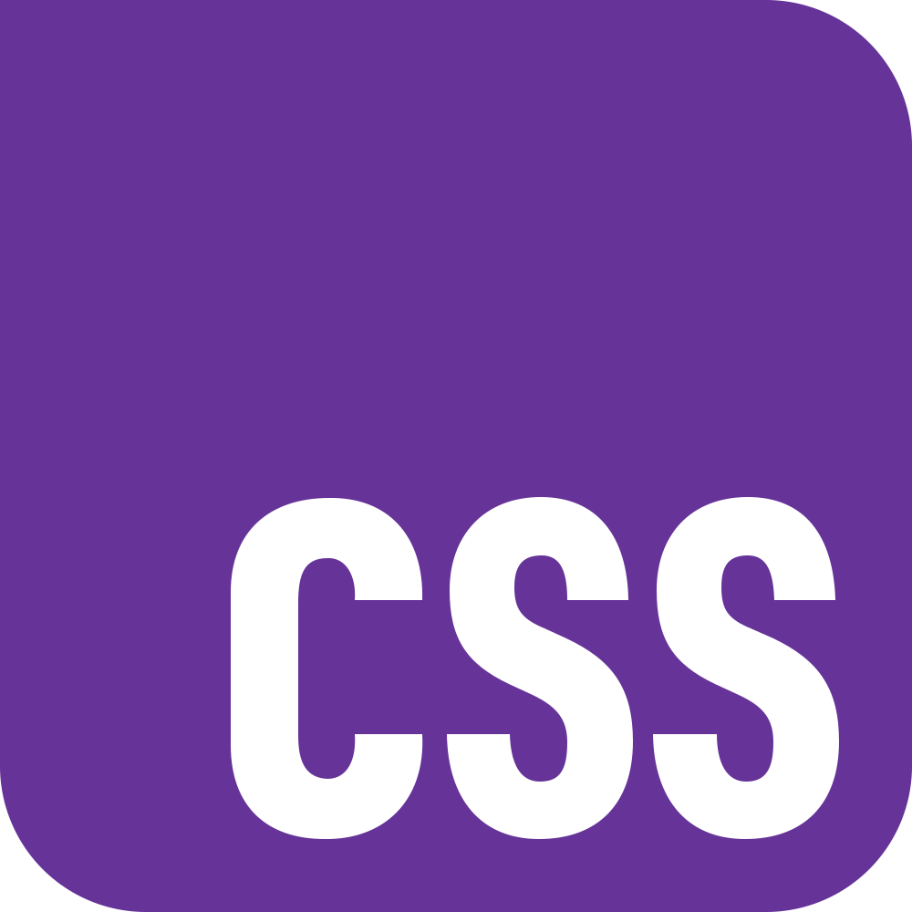

## Hi there, I'm Andrii 👋💻

## About Me :
👨‍💻 I'm a front-end developer passionate about building web applications and enhancing cybersecurity awareness.

## Roadmap 2025 :
📌 - **Improve:** HTML | CSS | JavaScript | React | Node.js  
📚 - **Learn:** Ethical Hacking | React Native | Next.js

## My stack and tools :

<table align="center">
  <tr>
    <td align="center"  width="88">
      
       HTML5
    </td>
    <td align="center" width="88">
      
       CSS3
    </td>
    <td align="center" width="88">  
      
       JavaScript
    </td>
    <td align="center" width="88">
      
       TypeScript
    </td>
    <td align="center" width="88">
      
       React.js
    </td>
    <td align="center" width="88">
      
       Node.js
    </td>
    
  </tr>
  <tr>
    <td align="center" width="88">
        
       Redux
    </td>
      <td align="center" width="88">
        
       Postman
    </td>
      </td>
      <td align="center" width="88">
        
       MongoDB
     </td>
     <td align="center" width="88">
        
       Git
    </td>
    <td align="center" width="88">
      
       VSCode
    </td>
    <td align="center" width="88">
      
       Figma
    </td>
  </tr>
</table>

## My hack tools :

  <table align="center">
    <tr>
      <td align="center" width="100">
        
      </td>
      <td align="center" width="100">
        
      </td>
      <td align="center" width="100">
        
      </td>
      <td align="center" width="100">
        
      </td>
      <td align="center" width="100">
        
      </td>
      <td align="center" width="100">
        
      </td>
      <td align="center" width="100">
        
      </td>
      <td align="center" width="100">
        
      </td>
      <td align="center" width="100">
        
      </td>
    </tr>
  </table>

